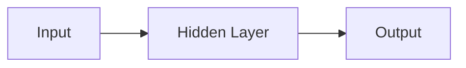
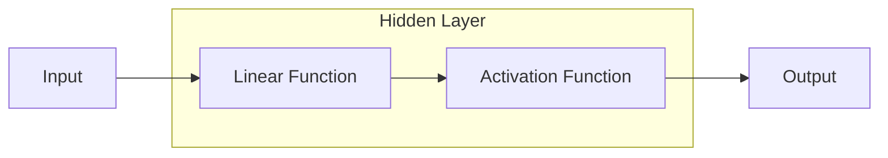

케라스는 파이썬으로 작성된 오픈소스 신경망 라이브러리이다. 빠른 실험이 가능하게끔 구현되어 있으며, 최소한의 모듈 방식의 확장성을 초점으로 두었다. 

이 문서는 Udemy의 한 [Course](https://www.udemy.com/course/keras-deep-learning/)를 기초로 하는 강의 노트이다.
{:.info}
<!--more-->

---
# Deep Learning
딥 러닝이란 Big Data를 입력받아 [Neural Net](https://ko.wikipedia.org/wiki/%EC%9D%B8%EA%B3%B5_%EC%8B%A0%EA%B2%BD%EB%A7%9D)구조를 사용하여 학습하는 프로그램이다. 학습을 통해 분류 및 예측을 하는 목적이 있다.

## 인공 신경망
생물학적으로 영감을 받아 프로그래밍으로 구현했다. 하나의 신경을 그림으로 그려보면 아래와 같다. 

그리고 아래는 인공 신경망중의 하나인 퍼셉트론이다.

   